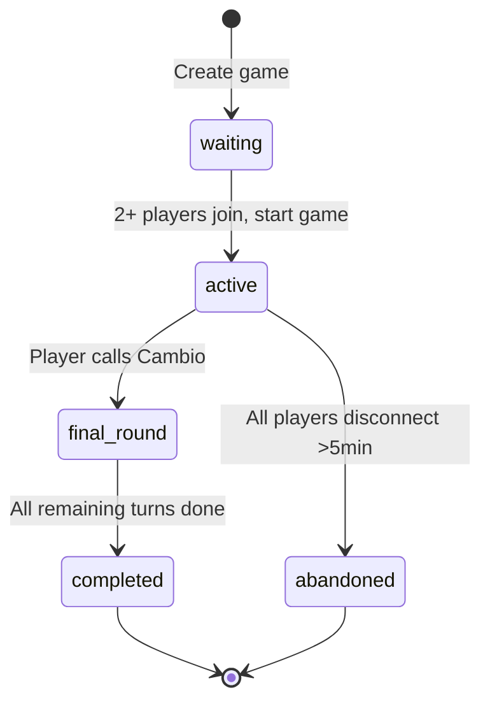
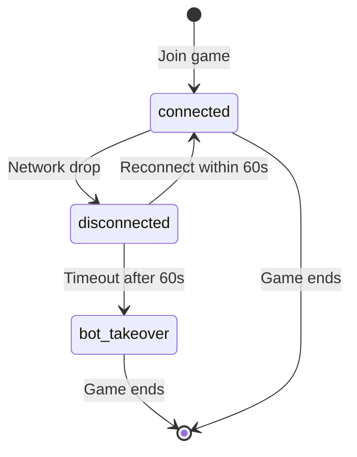

# Data Model: Core Cambio Game Mechanics

**Branch**: `001-core-game-mechanics` | **Date**: 2025-10-19
**Purpose**: Define database schema, entity relationships, and state transitions

## Entity Relationship Diagram

```
┌─────────────────┐
│   User          │ (inherited from Better Auth)
│─────────────────│
│ id: uuid (PK)   │
│ email: string   │
│ name: string    │
└────────┬────────┘
         │
         │ 1:N
         │
┌────────▼────────────────┐
│   GamePlayer            │
│─────────────────────────│
│ id: uuid (PK)           │
│ game_id: uuid (FK)      │◄──┐
│ user_id: uuid (FK/null) │   │
│ position: int (0-3)     │   │
│ is_bot: boolean         │   │ N:1
│ bot_difficulty: enum    │   │
│ cards: json[]           │   │
│ score: int              │   │
│ connection_status: enum │   │
│ joined_at: timestamp    │   │
└─────────────────────────┘   │
                              │
         ┌────────────────────┘
         │
┌────────▼──────────────────┐
│   GameSession             │
│───────────────────────────│
│ id: uuid (PK)             │
│ room_code: string (UNIQUE)│
│ status: enum              │
│ current_turn: int (0-3)   │
│ phase: enum               │
│ draw_pile: json[]         │
│ discard_pile: json[]      │
│ cambio_caller_id: uuid    │
│ version: int              │
│ created_at: timestamp     │
│ started_at: timestamp     │
│ ended_at: timestamp       │
└─────────┬─────────────────┘
          │
          │ 1:N
          │
┌─────────▼──────────────────┐
│   GameAction               │
│────────────────────────────│
│ id: uuid (PK)              │
│ game_id: uuid (FK)         │
│ player_id: uuid (FK)       │
│ action_type: enum          │
│ payload: jsonb             │
│ timestamp: timestamp       │
│ sequence_number: int       │
└────────────────────────────┘

┌────────────────────────────┐
│   GameHistory              │
│────────────────────────────│
│ id: uuid (PK)              │
│ game_id: uuid (FK)         │
│ winner_id: uuid (FK)       │
│ players: jsonb             │
│ final_scores: jsonb        │
│ total_turns: int           │
│ duration_seconds: int      │
│ completed_at: timestamp    │
└────────────────────────────┘
```

## Entities

### 1. GameSession

Represents an active or completed game of Cambio.

**Fields**:
- `id` (uuid, PK): Unique game identifier
- `room_code` (string, unique): 6-character code for joining (e.g., "ABC123")
- `status` (enum): `waiting`, `active`, `final_round`, `completed`, `abandoned`
- `current_turn` (int 0-3): Index of player whose turn it is
- `phase` (enum): `setup`, `initial_view`, `playing`, `final_round`, `scoring`, `complete`
- `draw_pile` (json[]): Array of card objects remaining in deck
- `discard_pile` (json[]): Array of card objects in discard (top card visible)
- `cambio_caller_id` (uuid, nullable): Player who called Cambio
- `version` (int): Optimistic locking counter for concurrency control
- `created_at` (timestamp): When game was created
- `started_at` (timestamp, nullable): When first card was dealt
- `ended_at` (timestamp, nullable): When game finished

**Indexes**:
- `idx_room_code` on `room_code` (for quick joining)
- `idx_status` on `status` (for listing active games)

**Validation Rules**:
- `status` transitions: `waiting → active → final_round → completed`
- `current_turn` must be 0-3 (max 4 players)
- `draw_pile` and `discard_pile` combined must total ≤52 cards
- `room_code` must be uppercase alphanumeric, length 6

**State Transitions**:
```
waiting → active: When 2+ players join and game starts
active → final_round: When a player calls Cambio
final_round → completed: After all remaining players take one turn
active → abandoned: If all players disconnect for >5 minutes
```

---

### 2. GamePlayer

Represents a human or AI player participating in a game.

**Fields**:
- `id` (uuid, PK): Unique player instance ID (different from user_id)
- `game_id` (uuid, FK): Reference to GameSession
- `user_id` (uuid, FK, nullable): Reference to User (null if bot)
- `position` (int 0-3): Seat position at table (determines turn order)
- `is_bot` (boolean): True if AI player, false if human
- `bot_difficulty` (enum, nullable): `easy`, `medium`, `hard` (null if human)
- `cards` (json[]): Array of 4 card objects in 2x2 grid ([top-left, top-right, bottom-left, bottom-right])
- `score` (int): Calculated sum of card values (updated at end of round)
- `connection_status` (enum): `connected`, `disconnected`, `bot_takeover`
- `joined_at` (timestamp): When player joined the game

**Indexes**:
- `idx_game_user` on `(game_id, user_id)` (prevent duplicate joins)
- `idx_game_position` on `(game_id, position)` (unique positions)

**Validation Rules**:
- `position` must be unique within a game (0-3)
- `cards` array must have exactly 4 elements
- If `is_bot` is true, `user_id` must be null
- If `is_bot` is false, `user_id` must not be null
- `bot_difficulty` must be null if `is_bot` is false

**Card Object Structure** (in JSON):
```json
{
  "rank": "7" | "8" | "9" | "10" | "J" | "Q" | "K" | "A" | "2"-"6",
  "suit": "hearts" | "diamonds" | "clubs" | "spades",
  "value": 0-10,
  "visible_to": ["player_id_1", "player_id_2"] // Who can see this card
}
```

---

### 3. GameAction

Event sourcing table logging every game action.

**Fields**:
- `id` (uuid, PK): Unique action ID
- `game_id` (uuid, FK): Reference to GameSession
- `player_id` (uuid, FK): Reference to GamePlayer who performed action
- `action_type` (enum): Action category
- `payload` (jsonb): Type-specific action details
- `timestamp` (timestamp): When action occurred
- `sequence_number` (int): Sequential counter per game for ordering

**Action Types** and Payloads:

| action_type | Payload Structure | Example |
|-------------|-------------------|---------|
| `join_game` | `{ position: number }` | `{ position: 0 }` |
| `deal_cards` | `{ player_id: uuid, cards: Card[] }` | (server-generated) |
| `draw_from_deck` | `{ card: Card }` | `{ card: { rank: "7", suit: "hearts", ... }}` |
| `draw_from_discard` | `{ card: Card }` | `{ card: { rank: "K", suit: "spades", ... }}` |
| `swap_card` | `{ card_drawn: Card, position: 0-3, card_swapped_out: Card }` | `{ card_drawn: {...}, position: 2, card_swapped_out: {...} }` |
| `discard_without_swap` | `{ card: Card }` | `{ card: {...} }` |
| `use_power_peek_own` | `{ target_position: 0-3, revealed_card: Card }` | `{ target_position: 1, revealed_card: {...} }` |
| `use_power_peek_opponent` | `{ target_player_id: uuid, target_position: 0-3, revealed_card: Card }` | (only visible to acting player) |
| `use_power_blind_swap` | `{ own_position: 0-3, opponent_id: uuid, opponent_position: 0-3 }` | `{ own_position: 0, opponent_id: "...", opponent_position: 3 }` |
| `call_cambio` | `{ player_id: uuid }` | `{ player_id: "..." }` |
| `end_turn` | `{ next_player: number }` | `{ next_player: 1 }` |
| `calculate_scores` | `{ scores: {[player_id]: number} }` | `{ scores: { "player1": 12, "player2": 8 }}` |
| `declare_winner` | `{ winner_id: uuid, scores: object }` | `{ winner_id: "...", scores: {...} }` |

**Indexes**:
- `idx_game_sequence` on `(game_id, sequence_number)` (for ordered replay)
- `idx_timestamp` on `timestamp` (for time-based queries)

**Validation Rules**:
- `sequence_number` must increment monotonically per game (no gaps)
- `action_type` must match valid enum values
- `payload` must conform to schema for that action_type (validated via Zod)

---

### 4. GameHistory

Archived completed games for statistics and leaderboards.

**Fields**:
- `id` (uuid, PK): History record ID
- `game_id` (uuid, FK, unique): Reference to completed GameSession
- `winner_id` (uuid, FK): Player who won
- `players` (jsonb): Array of player summaries `[{ user_id, position, final_score, is_bot }]`
- `final_scores` (jsonb): Map of player_id → final score
- `total_turns` (int): Number of turns taken in game
- `duration_seconds` (int): Total game duration
- `completed_at` (timestamp): When game ended

**Indexes**:
- `idx_winner` on `winner_id` (for player stats)
- `idx_completed` on `completed_at` (for recent games)

**Validation Rules**:
- Only created when `GameSession.status = 'completed'`
- `duration_seconds` must be `ended_at - started_at`
- `total_turns` must match count of `end_turn` actions

---

## Validation Rules Summary

### Game Flow Validation

1. **Game Start**:
   - Must have 2-4 players
   - Each player must have unique position (0-3)
   - Status must transition `waiting → active`

2. **Turn Taking**:
   - Only current_turn player can take actions
   - Must draw (deck or discard) before swap/discard
   - Must end turn after action completes

3. **Card Swapping**:
   - Position must be 0-3 (valid grid position)
   - Drawn card must not already be in player's hand
   - Swapped-out card goes to discard pile

4. **Special Powers**:
   - Power activates only when specific rank is discarded
   - Peek target must exist (valid player, valid position)
   - Blind swap cannot target own card
   - Powers are optional (can skip if desired)

5. **Cambio Calling**:
   - Can only be called after a complete turn
   - Caller must be an active player
   - Triggers `final_round` phase
   - All other players get exactly one more turn

6. **Scoring**:
   - Calculated after final round completes
   - Card values: 2-10 = face value, J/Q = 10, K = 0, A = 1
   - Penalty for incorrect Cambio call: double caller's score
   - Winner = lowest score (caller wins ties)

### Data Integrity Constraints

- **Foreign Keys**: All FKs must reference valid IDs
- **Unique Constraints**: `room_code`, `(game_id, position)`
- **Check Constraints**:
  - `current_turn` BETWEEN 0 AND 3
  - `position` BETWEEN 0 AND 3
  - `status` IN valid enum values
  - `phase` IN valid enum values

---

## TypeScript Interfaces

```typescript
// Core types
export interface Card {
  rank: '2' | '3' | '4' | '5' | '6' | '7' | '8' | '9' | '10' | 'J' | 'Q' | 'K' | 'A'
  suit: 'hearts' | 'diamonds' | 'clubs' | 'spades'
  value: number // 0-10
  visible_to: string[] // player IDs who can see this card
}

export interface GameSession {
  id: string
  room_code: string
  status: 'waiting' | 'active' | 'final_round' | 'completed' | 'abandoned'
  current_turn: number // 0-3
  phase: 'setup' | 'initial_view' | 'playing' | 'final_round' | 'scoring' | 'complete'
  draw_pile: Card[]
  discard_pile: Card[]
  cambio_caller_id: string | null
  version: number
  created_at: Date
  started_at: Date | null
  ended_at: Date | null
}

export interface GamePlayer {
  id: string
  game_id: string
  user_id: string | null
  position: number // 0-3
  is_bot: boolean
  bot_difficulty: 'easy' | 'medium' | 'hard' | null
  cards: [Card, Card, Card, Card] // Always 4 cards in grid
  score: number
  connection_status: 'connected' | 'disconnected' | 'bot_takeover'
  joined_at: Date
}

export interface GameAction {
  id: string
  game_id: string
  player_id: string
  action_type: ActionType
  payload: Record<string, any>
  timestamp: Date
  sequence_number: number
}

export type ActionType =
  | 'join_game'
  | 'deal_cards'
  | 'draw_from_deck'
  | 'draw_from_discard'
  | 'swap_card'
  | 'discard_without_swap'
  | 'use_power_peek_own'
  | 'use_power_peek_opponent'
  | 'use_power_blind_swap'
  | 'call_cambio'
  | 'end_turn'
  | 'calculate_scores'
  | 'declare_winner'
```

---

## State Machine

### Game Session States



### Player Connection States



---

## Drizzle ORM Schema Preview

```typescript
// server/database/schema/game.ts
import { pgTable, uuid, varchar, integer, timestamp, jsonb, pgEnum, boolean } from 'drizzle-orm/pg-core'

export const gameStatusEnum = pgEnum('game_status', ['waiting', 'active', 'final_round', 'completed', 'abandoned'])
export const gamePhaseEnum = pgEnum('game_phase', ['setup', 'initial_view', 'playing', 'final_round', 'scoring', 'complete'])
export const connectionStatusEnum = pgEnum('connection_status', ['connected', 'disconnected', 'bot_takeover'])

export const gameSessions = pgTable('game_sessions', {
  id: uuid('id').primaryKey().defaultRandom(),
  roomCode: varchar('room_code', { length: 6 }).notNull().unique(),
  status: gameStatusEnum('status').notNull().default('waiting'),
  currentTurn: integer('current_turn').notNull().default(0),
  phase: gamePhaseEnum('phase').notNull().default('setup'),
  drawPile: jsonb('draw_pile').notNull(),
  discardPile: jsonb('discard_pile').notNull(),
  cambioCallerId: uuid('cambio_caller_id'),
  version: integer('version').notNull().default(1),
  createdAt: timestamp('created_at').notNull().defaultNow(),
  startedAt: timestamp('started_at'),
  endedAt: timestamp('ended_at'),
})

export const gamePlayers = pgTable('game_players', {
  id: uuid('id').primaryKey().defaultRandom(),
  gameId: uuid('game_id').notNull().references(() => gameSessions.id),
  userId: uuid('user_id'), // Nullable for bots
  position: integer('position').notNull(), // 0-3
  isBot: boolean('is_bot').notNull().default(false),
  botDifficulty: varchar('bot_difficulty', { length: 10 }),
  cards: jsonb('cards').notNull(),
  score: integer('score').notNull().default(0),
  connectionStatus: connectionStatusEnum('connection_status').notNull().default('connected'),
  joinedAt: timestamp('joined_at').notNull().defaultNow(),
})

// Additional tables: gameActions, gameHistory (similar structure)
```

This data model provides a complete foundation for implementing all functional requirements with proper validation, state management, and audit trails.
